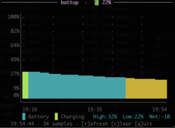

# battop

A minimal, htop-style battery history chart for macOS.



## Features

- Full-terminal battery % chart with Unicode block characters for smooth resolution
- Charging periods highlighted in green
- History persists to `~/.battop_history.json` (last 24 hours)
- Resizes dynamically to fill your terminal

## Usage

```bash
python3 battop.py
```

No dependencies beyond Python 3 and macOS.

### Keys

| Key | Action |
|-----|--------|
| `q` | Quit |
| `r` | Force refresh |
| `c` | Clear history |

## How it works

Reads battery data from `pmset -g batt` and `ioreg -rc AppleSmartBattery`, samples once per minute, and renders a time-series chart using curses.
